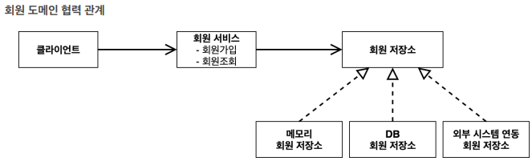
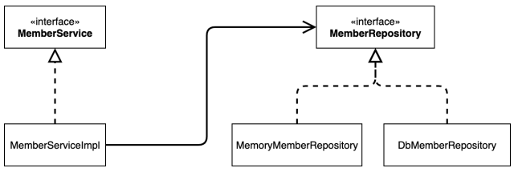
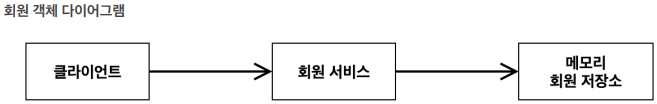

# spring_memberProject

### 순서

회원 도메인 설계, 개발

회원 도메인 실행과 테스트

주문과 할인 도메인 설계, 개발

주문과 할인 도메인 실행과 테스트 

### 회원
회원을 가입하고 조회할 수 있음

회원은 일반과 VIP 2가지 등급이 존재

회원 데이터 자체 DB 구축 가능, 외부 시스템과 연동 할 수 있음(그러나 미확정)
### 주문과 할인 정책
회원은 상품을 주문 가능

회원 등급에 따라 할인 정책 적용

할인 정책은 모든 VIP는 1000원 할인 고정 금액 할인 적용 요구
(추후 변경 가능성 있음)

할인 정책은 변경 가능성이 높고 회사의 기본 할인 정책 미정
오픈 직전까지 미확정, 최악의 경우 할인 적용 X

:현재 결정 되지 않은 부분이 있음, 객체 지향 설계 방법 사용

-> SOLID

SRP:단일 책임 원칙(single responsibility principle)

OCP:개방-폐쇄 원칙(Open/closed principle)

LSP:리스코프 치환 원칙(Liskov substitution principle)

ISP:인터페이스 분리 원칙(Interface segregation principle)

DIP:의존관계 역전 원칙(Dependency inversion principle)

:인터페이스 만들고 구현체를 갈아 끼울 수 있도록 설계 

### 회원 도메인 설계

### *새로운 단축키...
psvm+enter

soutv 

Alt+insert -> generate 

Ctrl+A -> 전체 선택

Shift+Ctrl+Alt+L ->코드 정렬