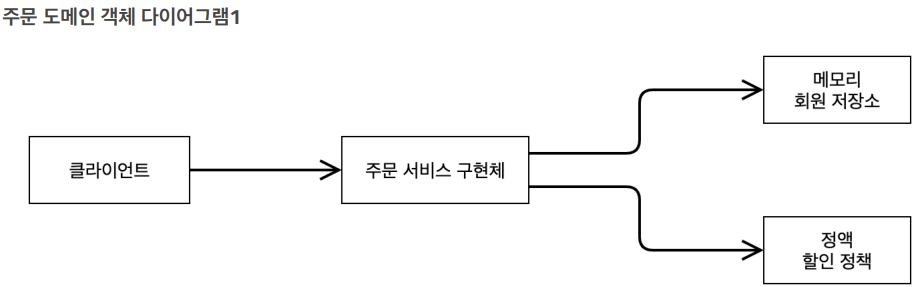

# spring_memberProject


### 순서

회원 도메인 설계, 개발  
회원 도메인 실행과 테스트  
주문과 할인 도메인 설계, 개발  
주문과 할인 도메인 실행과 테스트 

### 회원
회원을 가입하고 조회할 수 있음  
회원은 일반과 VIP 2가지 등급이 존재  
회원 데이터 자체 DB 구축 가능, 외부 시스템과 연동 할 수 있음(그러나 미확정)

### 주문과 할인 정책
회원은 상품을 주문 가능  
회원 등급에 따라 할인 정책 적용  
할인 정책은 모든 VIP는 1000원 할인 고정 금액 할인 적용 요구
(추후 변경 가능성 있음)  
할인 정책은 변경 가능성이 높고 회사의 기본 할인 정책 미정
오픈 직전까지 미확정, 최악의 경우 할인 적용 X

:현재 결정 되지 않은 부분이 있음, 객체 지향 설계 방법 사용

-> SOLID

SRP:단일 책임 원칙(single responsibility principle)

OCP:개방-폐쇄 원칙(Open/closed principle)

LSP:리스코프 치환 원칙(Liskov substitution principle)

ISP:인터페이스 분리 원칙(Interface segregation principle)

DIP:의존관계 역전 원칙(Dependency inversion principle)


:인터페이스 만들고 구현체를 갈아 끼울 수 있도록 설계 

### 회원 도메인 설계


### 회원 도메인 설계 문제점
설계상 문제점은 무엇인가?  
다른 저장소로 변경할 때 OCP 원칙을 잘 준수할까?  
DIP를 잘 지키고 있나?

=>의존관계가 인터페이스 뿐만 아니라 구현까지 모두 의존...  
MemberServiceImpl은 MemberRepository와 MemoryMemberRepository 추상화, 구현체에도 의존...DIP위반  

---
### 주문과 할인 도메인 설계

회원은 상품 주문 가능  
회원 등급에 따라 할인 정책 적용  
할인 정책은 모든 VIP는 1000원 할인(고정 금액 할인 적용-추후 변경 가능성 O)  
최악의 경우 할인 적용 X  

1.주문 생성: 클라이언트는 주문 서비스에 주문 생성 요청  
2.회원 조회: 할인을 위해서는 회원 등급 필요, 주문 서비스는 회원 저장소에서 회원 조회  
3.할인 적용: 주문 서비스는 회원 등급에 따른 할인 여부를 할인 정책에 위임  
4.주문 결과 반환: 주문 서비스는 할인 결과를 포함한 주문 결과 반환  

*주문 데이터 DB 저장X, 주문 결과 단순 반환만함 





회원을 메모리에서 조회, 정액 할인 정책(고정 금액)을 지원해도 주문 서비스 변경하지 않아도 됨  
역할들의 협력 관계를 그대로 재사용 가능  
:메모리에서 DB로 바뀌거나 정액 할인 정책이 정률 할인 정책이 되어도 그대로 재사용 가능  
(객체지향의 사실과 오해를 읽어보자...)

---

### 새로운 할인 정책 개발

요구사항-주문 금액당 할인하는 정률 % 할인으로 변경  
예를 들어서 기존 정책은 VIP가 얼마를 주문하던지 항상 1000원 할인  
새 정책은 10%로 지정하면 주문 금액에 따라 할인 가격이 달라져야 함

---

### 새로운 할인 정책 적용과 문제점

->할인 정책을 변경하려면 클라이언트인 OrderServiceImpl를 고쳐야 함  
  
문제점  
1.역할과 구현을 충실하게 분리했나? O  
2.다형성 활용, 인터페이스와 구현 객체 분리했나? O  
3.OCP, DIP 등 객체지향 설계 원칙을 준수했나? 그렇게 보이나 사실은 X  
4.DIP 주문서비스 클라이언트('OrderServiceIml')는 DiscountPolicy 인터페이스에 의존하고 DIP를 지킨 것 처럼 보임  
->클래스 의존관계를 보면 추상(인터페이스)뿐만 아니라 구체(구현)클래스에도 의존  
- 추상(인터페이스)의존 'DiscountPolicy'  
- 구체(구현)클래스 'FixDiscountPolicy', 'RateDiscountPolicy'  

5.OCP 변경하지 않고 확장 가능?  
->지금 코드는 기능을 확장해서 변경하면 클라이언트 코드에 영향을 줌->OCP 위반  
  
DiscountPolicy 인터페이스에만 의존한다고 생각함  
  
OrderServiceImpl는 DiscountPolicy 인터페이스 뿐만 아니라 FixDiscountPolicy인 구현체 클래스에도 함께 의존  
  
->FixDiscountPolicy를 RateDiscountPolicy로 변경하는 순간 OrderServiceImpl의 소스 코드도 함께 변경해야 함  
##### OCP 위반!

### 문제 해결 방법    
클라이언트 코드 OrderServiceImpl는 DiscountPolicy의 인터페이스 뿐만 아니라 구현 클래스에도 의존  
구현 클래스를 변경할 때 클라이언트 코드도 함께 변경해야 하는 상황  
->추상(인터페이스)에만 의존하도록 하자  
##### 인터페이스에만 의존하도록 설계  
  
이렇게 되면 구현체가 없음  

##### NullPointerException 발생...  
->DIP를 지키면 다른 문제가 발생  
->OrderServiceIml에 DiscountPolicy 대신 구현 객체 생성과 주입 필요  

---  

### 관심사 분리  
자신의 역할을 수행하는 것에만 집중
어떠한 것이 오더라도 똑같이 동작할 수 있어야 함
역할에 맞도록 지정하는 책임을 담당하는 별도의 기획자가 나와야 함
  
### AppConfig  
애플리케이션의 전체 동작 방식을 구성, 설정하기  
구현 객체를 생성하고 연결하는 책임을 가지는 별도의 설정 클래스 생성    

AppConfig는 애플리케이션의 실제 동작이 필요한 구현 객체 모두 생성  
- MemberServiceIml  
- MemoryMemberRepository  
- OrderServiceIml
- FixDiscountPolicy    

AppConfig는 생성한 객체 인스턴스의 참조(레퍼런스)를 '생성자를 통해 주입(연결)'  
- MemberServiceIml->MemoryMemberRepository
- OrderServiceIml->MemoryMemberRepository, FixDiscountPolicy  
   
```public class MemberServiceImpl implements MemberService{

    //오로지 MemberRepository 인터페이스에만 의존하게 됨 -> 추상화에만 의존 
    private final MemberRepository memberRepository;

    //생성자를 통해 MemberRepository에 어떤 구현체가 들어가는지 선택
    public MemberServiceImpl(MemberRepository memberRepository) {
        this.memberRepository = memberRepository;
    }//생성자 만듦

    @Override
    public void join(Member member) {memberRepository.save(member);}//다형성에 의해서 인터페이스가 아니라 MemoryMemberRepository에 있는 save가 호출됨

    @Override
    public Member findMember(Long memberId) {
        return memberRepository.findById(memberId);
    }

}
```  

##### 설계 변경  
MemberSerImpl은 MemoryMemberRepository를 의존하지 않음  
->단지 MemeberRepository 인터페이스에 의존  
* 생성자를 통해 어떤 구현객체가 주입될지 알 수 없음  
* 생성자를 통해 어떤 구현 객체를 주입할지는 오직 AppConfig에서 결정
* 의존관계에 대한 고민은 AppConfig에 맡기고 실행에만 집중하게 됨  

##### 클래스 설명  
MemeberService 인터페이스를 구현하는 것은 MemberServiceImpl임  
MemberServiceImpl는 MemberRepository 인터페이스를 의존  
여기서 AppConfig를 만들면  
MemeberServiceImpl와 MemoryMemeberRepository 생성을 AppConfig가 담당함  
객체와 생성과 연결을 AppConfig가 담당  
->DIP 완성->관심사 분리->객체를 생성하고 연결하는 역할과 실행하는 역할 분리       
  
```
public class OrderServiceImpl implements OrderService{
    //아래 두개 필요 MemoryMemberRepository와 FixDiscountPolicy 구현체가 있어야지
    private final MemberRepository memberRepository;
    private final DiscountPolicy discountPolicy;
    //final로 되어있으면 생성자를 통해 할당이 되어야 함
    //DIP를 지키고 있음
    //인터페이스에만 의존

    public OrderServiceImpl(MemberRepository memberRepository, DiscountPolicy discountPolicy) {
        this.memberRepository = memberRepository;
        this.discountPolicy = discountPolicy;
    }

    //private final DiscountPolicy discountPolicy=new FixDiscountPolicy();
    //private final DiscountPolicy discountPolicy=new RateDiscountPolicy();
    @Override
    public Order createOrder(Long memberId, String itemName, int itemPrice) {
        //일단 멤버 찾고
        Member member = memberRepository.findById(memberId);
        int discountPrice = discountPolicy.discount(member, itemPrice);
        //설계가 잘된거임...할인에 대한건 discountPolicy 니가 알아서 해 =>단일 책임 원칙 준수

        //orderServiceImpl 역할 끝
        //조회후 할인 정책에다가 회원을 그냥 넘김
        //Grade만 넘길지 회원을 넘길지 고민하면 됨
        return new Order(memberId, itemName, itemPrice, discountPrice);
    }
}
```  
OrderServiceImpl도 설계 변경  
FixDiscountPolicy를 의존하지 않음  
생성자를 통해 어떤 구현 객체가 주입될지 알 수 없음->AppConfig가 결정  
이제 실행에만 집중    
  
---  
  
##### 마무리  
* AppConfig를 통해 관심사를 확실하게 분리  
* MemberServiceImpl, OrderServiceImpl는 기능을 실행하는 책임만 지면 됨  
  
### AppConfig refactoring 
현재 AppConfig의 문제점
* AppConfig에 중복 존재  
* 역할에 따른 구현이 잘 보이지 않음    
  
##### 현재 AppConfig
  
```
public class AppConfig {

    public MemberService memberService() {
        return new MemberServiceImpl(new MemoryMemberRepository()); //생성자 주입 //내가 만든 MemeberServiceImpl은 MemoryMemeberRepository를 쓸거야 주입!
    }

    public OrderService orderService() {
        return new OrderServiceImpl(new MemoryMemberRepository(), new FixDiscountPolicy()); //생성자 주입

    }
}

```    
원하는 구조
  
  
```
public class AppConfig {

    public MemberService memberService(){
        return new MemberServiceImpl(memberRepository());
    }
    private MemberRepository memberRepository(){
        return new MemoryMemberRepository();
    }

    public OrderService orderService() {
        return new OrderServiceImpl(memberRepository(),discountPolicy()); 

    }
    public DiscountPolicy discountPolicy(){
        return new FixDiscountPolicy();
    }
}
```  
  
* new MemoryMemeberRepository()이 부분이 중복 제거
* MemoryMemberRepository를 다른 구현체로 변경할 때 한 부분만 변경하면 됨  
* AppConfig를 보면 역할과 구현 클래스가 한 눈에 들어옴 
  
---  
  
AppConfig만 고쳐서 할인 정책 변경   
   
  
OrderApp을 실행  
FixDiscountPolicy
    
RateDiscountPolicy
  
  
OrderServiceImpl은 변경X  
구성영역의 코드만 교체하면 됨  
->OCP DIP 모두 만족  
  
---  
  
##### SRP/DIP/OCP 적용  
SRP 단일 책임 원칙  
* 클라이언트 객체는 직접 구현 객체 생성, 연결, 실행하는 다양한 책임을 가졌었음  
* SRP 원칙을 따르면서 관심사 분리
* 구현 객체 생성, 연결 책임을 AppConfig에 넘김
* 클라이언트 객체는 실행하는 책임만 가짐  
  
DIP 의존관계 역전 원칙  
"프로그래머는 추상화에 의존해야지, 구체화에 의존하면 안된다."  
* 새로운 할인 정책 개발 후 적용할 때 클라이언트 코드도 함께 변경해야 했음  
* OrderServiceImpl는 DIP를 지키고 DiscountPolicy 추상화 인터페이스에 의존하는 것 처럼 보였으나 FixDiscountPolicy 구체화 구현 클래스에도 의존  
* 클라이언트 코드가 DiscountPolicy 추상화 인터페이스에만 의존하도록 코드 변경  
* AppConfig가 FixDiscountPolicy 객체 인스턴스를 클라이언트 코드 대신 생성  
* 클라이언트 코드에 의존관계 주입->DIP 원칙 따름   
  
OCP  
"소프트웨어 요소 확장에는 열려있으나 변경에는 닫혀 있어야 한다."  
* 다형성 사용, 클라이언트 DIP 지킴  
* application을 사용영역과 구성영역으로 나눔  
* AppConfig가 의존관계를 FixDiscountPolicy에서 RateDiscountPolicy로 변경, 클라이언트 코드에 주입->클라이언트 코드 변경X  
* "소프트웨어 요소를 새롭게 확장해도 사용 영역의 변경은 닫혀 있다."  
  
---  
   
##### ApplicationContext 스프링컨테이너 

  
```
//스프링 컨테이너 생성
ApplicationContext applicationContext =
 new AnnotationConfigApplicationContext(AppConfig.class);
```    
  
* ApplicationContext -> 스프링 컨테이너, 인터페이스  
* 스프링 컨테이너는 XML을 기반으로 만들 수 있음, 애노테이션 기반의 자바 설정 클래스 만들 수 있음  
* AppConfig를 사용했던 방식이 애노테이션 기반 자바 설정 클래스로 스프링 컨테이너 생성  
  
  
* new AnnotationConfigApplicationContext(AppConfig.class)  
* 스프링 컨테이너를 생성할 때 구성 정보 지정 (여기서는 AppConfig.class를 구성 정보로 지정)  
* 스프링 컨테이너는 파라미터로 넘어온 설정 클래스 정보를 사용하여 스프링 빈 등록  
* 빈 이름은 메서드 이름 사용  
* 빈 이름을 직접 부여 할 수도 있음 ex) @Bean(name="memberService2")  
* 빈 이름은 항상 다른 이름 부여함 (같은 이름을 부여하면 다른 빈 무시 or 기존 빈 덮어버림)  
* 스프링 컨테이너는 설정 정보를 참고하여 의존관계 주입(DI)  
  
  
  
```
public class ApplicationContextInfoTest {
    AnnotationConfigApplicationContext ac = new AnnotationConfigApplicationContext(AppConfig.class);

    @Test
    @DisplayName("모든 빈 출력")
    void findAllBean() {
        String[] beanDefinitionNames = ac.getBeanDefinitionNames();
        for (String beanDefinitionName : beanDefinitionNames) {
            Object bean = ac.getBean(beanDefinitionName);
            System.out.println("name = " + beanDefinitionName + "object = " + bean);

        }
    }

    //등록한 빈 5개만 출력하도록 만들어주는 코드
    @Test
    @DisplayName("애플리케이션 빈 출력")
    void findApplicationBean() {
        String[] beanDefinitionNames = ac.getBeanDefinitionNames();
        for (String beanDefinitionName : beanDefinitionNames) {
            //BeanDefinition 빈에 대한 메타데이터 빈 하나하나의 정보를 꺼냄
            BeanDefinition beanDefinition = ac.getBeanDefinition(beanDefinitionName);

            //ROLE_APPLICATION 애플리케이션을 주로 개발하기 위해 등록한 빈을 출력
            //ROLE_APPLICATION: 직접 등록한 애플리케이션 빈
            //ROLE_INFRASTRUCTURE: 스프링 내부에서 사용하는 빈
            if (beanDefinition.getRole() == BeanDefinition.ROLE_APPLICATION) {
                Object bean = ac.getBean(beanDefinitionName);
                System.out.println("name = " + beanDefinitionName + "object = " + bean);
            }

        }
    }
}
```  
  
##### 모든 빈 출력  
* ac.getBeanDefinitionNames(): 스프링에 등록된 모든 빈 이름 조회  
* ac.getBean(): 빈 이름으로 빈 객체(인스턴스) 조회  (스프링 컨테이너에서 찾아옴)
##### Application 빈 출력  
* 스프링 내부에서 사용하는 빈 제외, 등록한 빈만 출력  
* 스프링 내부에서 사용하는 빈 -> getRole()로 구분  
  
##### 빈을 조회하는 기본적인 방법    
##### 동일한 타입 둘 이상  
```
public class ApplicationContextSameBeanFindTest {
    AnnotationConfigApplicationContext ac = new AnnotationConfigApplicationContext(SameBeanConfig.class);
    @Test
    @DisplayName("타입으로 조회할 때 같은 타입이 둘 이상 있으면 중복 오류 발생")
    void findBeanTypeDuplicate(){
        MemberRepository bean = ac.getBean(MemberRepository.class); //type만 설정, 호출했을 때 예외가 터짐
    }
    //Config를 여기 안에서만 쓸 수 있는 것을 하나 만들자
    @Configuration
    static class SameBeanConfig{

        @Bean
        public MemberRepository memberRepository1(){
            return new MemoryMemberRepository();
        }
        @Bean
        public MemberRepository memberRepository2(){
            return new MemoryMemberRepository();
        }
    }

}
```  
예외 발생 
```
org.springframework.beans.factory.NoUniqueBeanDefinitionException:expected single matching bean but found 2: memberRepository1,memberRepository2
```   
Bean 두개 찾아짐 MemberRepository1,2    
```  
    @Test
    @DisplayName("타입으로 조회할 때 같은 타입이 둘 이상 있으면 중복 오류 발생")
    void findBeanTypeDuplicate() {
//        MemberRepository bean = ac.getBean(MemberRepository.class); //type만 설정, 호출했을 때 예외가 터짐
        assertThrows(NoUniqueBeanDefinitionException.class,
                () -> ac.getBean(MemberRepository.class));
    }
    
```    
현재 Bean이 2개 등록되어 있음
``` 
   @Test
    @DisplayName("특정 타입 모두 조회")
    void findAllBeanByType() {
        Map<String, MemberRepository> beanOfType = ac.getBeansOfType(MemberRepository.class);
        for (String key : beanOfType.keySet()) {
            System.out.println("key = " + key + " value = " + beanOfType.get(key));

        }
        System.out.println("beanOfType = " + beanOfType);
        assertThat(beanOfType.size()).isEqualTo(2);
    }
```  
  
---  
  
##### 스프링 빈 상속관계  
모든 Java객체의 최상위 부모는 Object   
Object 타입으로 조회하면 모든 스프링 빈을 조회  
  
##### BeanDefinition  
Spring은 BeanDefinition으로 Bean의 설정 메타 정보를 추상화함  
Spring Bean을 만드는 방법은 2개  
* 직접 Spring Bean 등록
* FactoryBean 사용 ex)appConfig  
  
##### 싱글톤  
객체가 JAVA JVM 안에 하나만 있어야 하는 패턴  
  
##### 스프링 X 순수한 DI Container 
```
public class SingleTon {
    @Test
    @DisplayName("스프링 없는 순수한 DI Container")
    void pureContainer(){
        AppConfig appConfig = new AppConfig();
        //1. 조회: 호출할 때 마다 객체 생성
        MemberService memberService1 = appConfig.memberService();
        //2. 조회: 호출할 때 마다 객체 생성
        MemberService memberService2 = appConfig.memberService();

        //참조값이 다른 것을 확인
        System.out.println("memberService1 = " + memberService1);
        System.out.println("memberService2 = " + memberService2);

    }
}
```  
참조값 확인  
  
JVM 메모리에 계속 객체 생성  
(웹 애플리케이션은 고객 요청이 많은데 계속 객체를 생성하는 것은 효율적이지 않음)  
* 현재 문제: 고객 트래픽이 초당 100이 나오면 초당 100개의 객체가 생성, 소멸 -> 메모리 낭비  
* 해결 방안: 객체가 1개만 생성되고 공유하도록 설계 -> 싱글톤 패턴  
  
#### 싱글톤 패턴  
* 클래스의 인스턴스가 딱 1개만 생성되는 것을 보장하는 디자인 패턴  
* 객체 인스턴스를 2개 이상 생성하지 못하도록 막음 ->  private 생성자를 사용해서 외부에서 임의로 new 키워드를 사용하지 못하도록 함  
  
```
public class SingletonService {
    //관례상 private로 하고 static으로 가지면 클래스 레벨에 올라가기 때문에 딱 하나만 존재하게 됨
    //1.static영역에 객체를 딱 1개만 생성
    private static final SingletonService instance = new SingletonService(); //객체를 생성하고 자기자신을 생성해서 instance에 참조를 넣어둠

    //2.public으로 열고 객체 인스턴스가 필요하면 이 static 메서드를 통해 조회하도록 허용
    //조회할 때 사용
    public static SingletonService getInstance(){
        return instance;
    }

   //private으로 만들어서 외부에서는 사용하지 못하게 함
    //3.생성자를 private로 선언, 외부에서 new 키워드를 사용한 객체 생성 막음
    private SingletonService(){
    }
    public void logic(){
        System.out.println("싱글톤 객체 로직 호출");
    }
}
```  
  
참조값이 같음, 객체를 1개만 생성  
  
AppConfig도 다 싱글톤으로...?  
Spring Container를 쓰면 모두 싱글톤으로 만들어서 관리해줌    
  
##### 싱글톤 패턴의 문제점    
* 싱글톤 패턴 구현할 때 코드가 많이 들어감  
* 의존관계상 클라이언트가 구체 클래스에 의존 -> DIP 위반, OCP 위반 가능성 높음  
* 테스트 어려움  
* 내부 속성 변경 or 초기화 어려움  
* private 생성자로 자식 클래스 만들기 어려움  
* 결론: 유연성이 떨어져서 안티 패턴이라고 불리기도 함  
  
#### Singleton Container  
주의할 점
* 싱글톤 패턴이든 싱글톤 컨테이너든 객체 인스턴스 하나만 생성해서 공유하는 방식은 여러 클라이언트가 하나의 같은 객체 인스턴스를 공유하기 때문에 싱글톤 객체는 상태를 유지(stateful)하게 설계 하면 안됨  
* 무상태(stateless)로 설계해야 함  
   * 특정 클라이언트에 의존적인 필드 없어야 함
   * 가급적 읽기만 가능하도록(값을 변경할 수 있는 필드 안됨)
   * 필드 대신 자바에서 공유되지 않는, 지역변수, 파라미터, ThreadLocal 등을 사용해야 함
* 스프링 빈의 필드에 공유 값을 설정하면 큰 장애 발생할 수 있음  
```
public class StatefulService {
    private int price; //상태를 유지하는 필드

    //주문을 해서 값을 저장하고
    public void order(String name, int price){
        System.out.println("name = " +name+"price = "+price);
        this.price=price; //여기 문제
    }
    //값을 꺼내고 싶었음
    public int getPrice(){
        return price;
    }
}
```

```
public class StatefulServiceTest {
    @Test
    void statefulServiceSingleton(){
        ApplicationContext ac= new AnnotationConfigApplicationContext(TestConfig.class);
        StatefulService statefulService1 = ac.getBean(StatefulService.class);
        StatefulService statefulService2 = ac.getBean(StatefulService.class);

        //ThreadA: A 사용자 10000원 주문
        statefulService1.order("uerA",10000);
        //ThreadA: A 사용자 10000원 주문 중간에 들어옴
        statefulService2.order("uerB",20000);

        //ThreadA: A 사용자 주문 금액 조회
        //기대한건 10000원인데 20000원 나옴
        int price= statefulService1.getPrice();
        System.out.println("price = "+price);

        Assertions.assertThat(statefulService1.getPrice()).isEqualTo(20000);

//        statefulService는 같은 객체인데 중간에 다른 값이 들어오면 바뀜..

    }

    static class TestConfig{
        @Bean
        public StatefulService statefulService(){
            return new StatefulService();
        }
    }
}
```  
중간에 ThreadB가 들어오자 price값이 바뀜  
##### 공유 필드 조심!  
StatefulService 의 price 필드는 공유되는 필드인데, 특정 클라이언트가 값을 변경  
##### -> 스프링 빈은 항상 무상태(stateless)로 설계해야 함   
##### -> 공유되지 않는 지역변수 파라미터 사용  
  
```
public class StatefulService {
//    private int price; //상태를 유지하는 필드

    //주문을 해서 값을 저장하고
    public int order(String name, int price){
        System.out.println("name = " +name+"price = "+price);
        return price;
    }

}

```  
```
public class StatefulServiceTest {
    @Test
    void statefulServiceSingleton(){
        ApplicationContext ac= new AnnotationConfigApplicationContext(TestConfig.class);
        StatefulService statefulService1 = ac.getBean(StatefulService.class);
        StatefulService statefulService2 = ac.getBean(StatefulService.class);

        //ThreadA: A 사용자 10000원 주문
        int userAPrice=statefulService1.order("uerA",10000);
        //ThreadA: A 사용자 10000원 주문 중간에 들어옴
        int userBPrice=statefulService2.order("uerB",20000);

        //ThreadA: A 사용자 주문 금액 조회
        //기대한건 10000원인데 20000원 나옴
        System.out.println("price = "+userAPrice);


//        statefulService는 같은 객체인데 중간에 다른 값이 들어오면 바뀜..

    }

    static class TestConfig{
        @Bean
        public StatefulService statefulService(){
            return new StatefulService();
        }
    }
}

```  
  
##### 지역변수는 공유되지 않아서 값이 제대로 나옴


  


  


  

  


##### *새로운 단축키...
psvm+enter

soutv 

Alt+insert -> generate 

Ctrl+A -> 전체 선택

Shift+Ctrl+Alt+L ->코드 정렬

F2 -> 오류 발생 지점으로 이동

Ctrl+Shift+T -> Test 생성

Assertions -> static method  demand static import하면 assertThat으로만 사용 가능

Ctrl+Shift6 -> 변수명 변경 일괄 적용  

Ctrl+E -> 과거 히스토리 목록    
  
Ctrl+Alt+M -> refactoring  
  
iter+Tap -> 리스트나 배열이 있을 때 for문 자동완성  
  
Ctrl+D -> 같은 코드 추가  
  
Ctrl+Shift+enter -> 코드 컴플리션으로 넘어감  
  
Ctrl+Alt+V -> introduce Variable