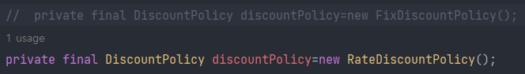

# spring_memberProject

### 순서

회원 도메인 설계, 개발  
회원 도메인 실행과 테스트  
주문과 할인 도메인 설계, 개발  
주문과 할인 도메인 실행과 테스트 

### 회원
회원을 가입하고 조회할 수 있음  
회원은 일반과 VIP 2가지 등급이 존재  
회원 데이터 자체 DB 구축 가능, 외부 시스템과 연동 할 수 있음(그러나 미확정)

### 주문과 할인 정책
회원은 상품을 주문 가능  
회원 등급에 따라 할인 정책 적용  
할인 정책은 모든 VIP는 1000원 할인 고정 금액 할인 적용 요구
(추후 변경 가능성 있음)  
할인 정책은 변경 가능성이 높고 회사의 기본 할인 정책 미정
오픈 직전까지 미확정, 최악의 경우 할인 적용 X

:현재 결정 되지 않은 부분이 있음, 객체 지향 설계 방법 사용

-> SOLID

SRP:단일 책임 원칙(single responsibility principle)

OCP:개방-폐쇄 원칙(Open/closed principle)

LSP:리스코프 치환 원칙(Liskov substitution principle)

ISP:인터페이스 분리 원칙(Interface segregation principle)

DIP:의존관계 역전 원칙(Dependency inversion principle)

:인터페이스 만들고 구현체를 갈아 끼울 수 있도록 설계 

### 회원 도메인 설계

### 회원 도메인 설계 문제점
설계상 문제점은 무엇인가?  
다른 저장소로 변경할 때 OCP 원칙을 잘 준수할까?  
DIP를 잘 지키고 있나?

=>의존관계가 인터페이스 뿐만 아니라 구현까지 모두 의존...  
MemberServiceImpl은 MemberRepository와 MemoryMemberRepository 추상화, 구현체에도 의존...DIP위반  

---
### 주문과 할인 도메인 설계

회원은 상품 주문 가능  
회원 등급에 따라 할인 정책 적용  
할인 정책은 모든 VIP는 1000원 할인(고정 금액 할인 적용-추후 변경 가능성 O)  
최악의 경우 할인 적용 X  

1.주문 생성: 클라이언트는 주문 서비스에 주문 생성 요청  
2.회원 조회: 할인을 위해서는 회원 등급 필요, 주문 서비스는 회원 저장소에서 회원 조회  
3.할인 적용: 주문 서비스는 회원 등급에 따른 할인 여부를 할인 정책에 위임  
4.주문 결과 반환: 주문 서비스는 할인 결과를 포함한 주문 결과 반환  

*주문 데이터 DB 저장X, 주문 결과 단순 반환만함 

회원을 메모리에서 조회, 정액 할인 정책(고정 금액)을 지원해도 주문 서비스 변경하지 않아도 됨  
역할들의 협력 관계를 그대로 재사용 가능  
:메모리에서 DB로 바뀌거나 정액 할인 정책이 정률 할인 정책이 되어도 그대로 재사용 가능  
(객체지향의 사실과 오해를 읽어보자...)

---

### 새로운 할인 정책 개발

요구사항-주문 금액당 할인하는 정률 % 할인으로 변경  
예를 들어서 기존 정책은 VIP가 얼마를 주문하던지 항상 1000원 할인  
새 정책은 10%로 지정하면 주문 금액에 따라 할인 가격이 달라져야 함

---

### 새로운 할인 정책 적용과 문제점  
  
->할인 정책을 변경하려면 클라이언트인 OrderServiceImpl를 고쳐야 함  
  
문제점  
1.역할과 구현을 충실하게 분리했나? O  
2.다형성 활용, 인터페이스와 구현 객체 분리했나? O  
3.OCP, DIP 등 객체지향 설계 원칙을 준수했나? 그렇게 보이나 사실은 X  
4.DIP 주문서비스 클라이언트('OrderServiceIml')는 DiscountPolicy 인터페이스에 의존하고 DIP를 지킨 것 처럼 보임  
->클래스 의존관계를 보면 추상(인터페이스)뿐만 아니라 구체(구현)클래스에도 의존  
- 추상(인터페이스)의존 'DiscountPolicy'  
- 구체(구현)클래스 'FixDiscountPolicy', 'RateDiscountPolicy'  

5.OCP 변경하지 않고 확장 가능?  
->지금 코드는 기능을 확장해서 변경하면 클라이언트 코드에 영향을 줌->OCP 위반  
  
DiscountPolicy 인터페이스에만 의존한다고 생각함  
  
OrderServiceImpl는 DiscountPolicy 인터페이스 뿐만 아니라 FixDiscountPolicy인 구현체 클래스에도 함께 의존  
  
->FixDiscountPolicy를 RateDiscountPolicy로 변경하는 순간 OrderServiceImpl의 소스 코드도 함께 변경해야 함  
##### OCP 위반!

### 문제 해결 방법    
클라이언트 코드 OrderServiceImpl는 DiscountPolicy의 인터페이스 뿐만 아니라 구현 클래스에도 의존  
구현 클래스를 변경할 때 클라이언트 코드도 함께 변경해야 하는 상황  
->추상(인터페이스)에만 의존하도록 하자  
##### 인터페이스에만 의존하도록 설계

### *새로운 단축키...
psvm+enter

soutv 

Alt+insert -> generate 

Ctrl+A -> 전체 선택

Shift+Ctrl+Alt+L ->코드 정렬

F2 -> 오류 발생 지점으로 이동

Ctrl+Shift+T -> Test 생성

Assertions -> static method  demand static import하면 assertThat으로만 사용 가능

Ctrl+Shift6 -> 변수명 변경 일괄 적용